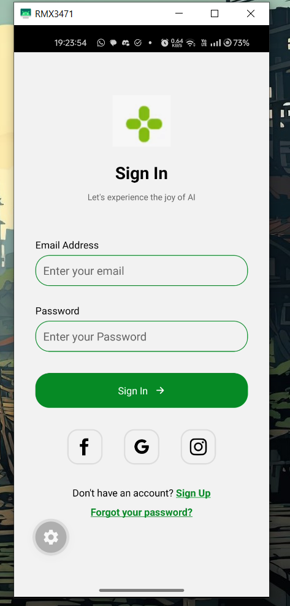

# 📱 Mobile Dev Cohort - Assignment 01

---

## ✨ UI Showcase

A preview of the modern Sign-In interface built for this assignment:

<div align="center">
  
  <p><i>The "Joy of AI" Sign-In Experience</i></p>
</div>

---

## 📂 Project Structure

```text
 assignments/01_assignment/
 ├── assets/             # Images and local fonts
 │   └── images/         # UI Screenshots and app assets
 ├── src/                # Source code
 │   ├── app/            # Expo Router pages
 │   │   ├── _layout.tsx # Root layout
 │   │   └── index.tsx   # Main Sign-In screen
 │   └── components/     # Reusable UI components
 ├── package.json        # Dependencies and scripts
 └── tsconfig.json       # TypeScript configuration
```

---

## 🚦 Getting Started

### 1. Install Dependencies
```bash
npm install
```

### 2. Run the Project
Start the Expo development server:
```bash
npx expo start
```

### 3. Open the App
- Scan the QR code with the **Expo Go** app (Android/iOS).
- Press `a` for Android Emulator.
- Press `i` for iOS Simulator.
- Press `w` for Web.

---

<p align="center">Made with ❤️ for the Mobile Dev Cohort</p>
