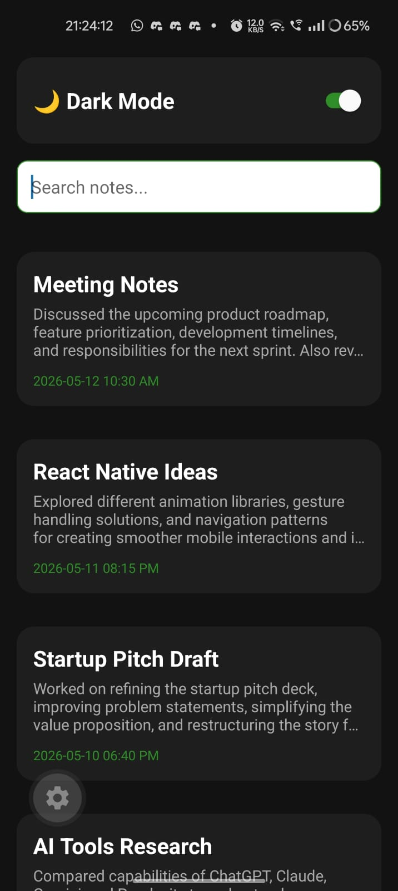
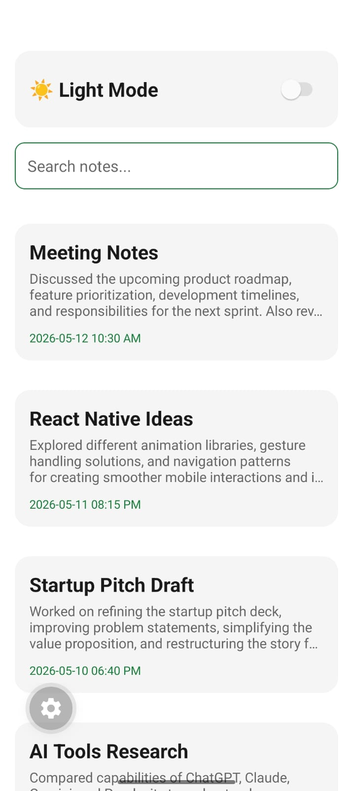
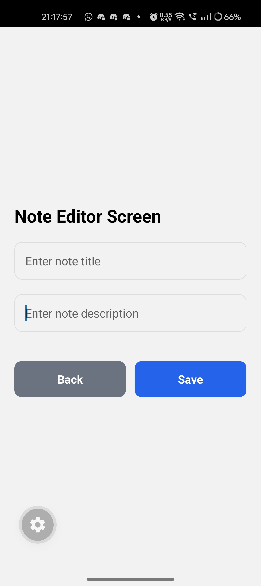

# 📝 Mobile Dev Cohort - Assignment 02

This project is a modern, responsive **Notes Application** featuring dynamic theme switching and a streamlined editing experience.

---

## ✨ UI Showcase

### 🎥 Demonstrations

#### Note Listing & Theme Toggle
https://github.com/Mdsaleh99/Mobile-Dev-Cohort-26/blob/main/assignments/02_assignment/assets/note-listing-vid.mp4

#### Note Editor Experience
https://github.com/Mdsaleh99/Mobile-Dev-Cohort-26/blob/main/assignments/02_assignment/assets/note-editor-screen-vid.mp4

### 📸 Screenshots

<div align="center">
  <table border="0">
    <tr>
      <td align="center">
        
        <p><i>Dark Mode List</i></p>
      </td>
      <td align="center">
        
        <p><i>Light Mode List</i></p>
      </td>
      <td align="center">
        
        <p><i>Editor Screen</i></p>
      </td>
    </tr>
  </table>
</div>

---

## 📂 Project Structure

```text
 assignments/02_assignment/
 ├── assets/                 # App assets (Videos, Icons, Images)
 ├── src/
 │   ├── app/
 │   │   ├── _layout.tsx     # Root layout & Navigation
 │   │   ├── components/     # Screen Components
 │   │   │   ├── NoteEditorScreen.tsx
 │   │   │   └── NotesListingScreen.tsx
 │   │   └── utils/          # Helper functions
 ├── package.json            # Scripts & Dependencies
 └── tsconfig.json           # TS Configuration
```

---

## 🚦 Getting Started

### 1. Install Dependencies
```bash
npm install
```

### 2. Run the Project
```bash
npx expo start
```

---

<p align="center">Made with ❤️ for the Mobile Dev Cohort</p>
