# Assignment 03 — React Navigation Masterclass

A React Native food delivery app built with Expo demonstrating nested navigation patterns including stack, tab, and drawer navigators with deep linking support.

## Demo

<video src="assets/app-img/video.mp4" controls width="300"></video>

## Screenshots

<table>
  <tr>
    <td>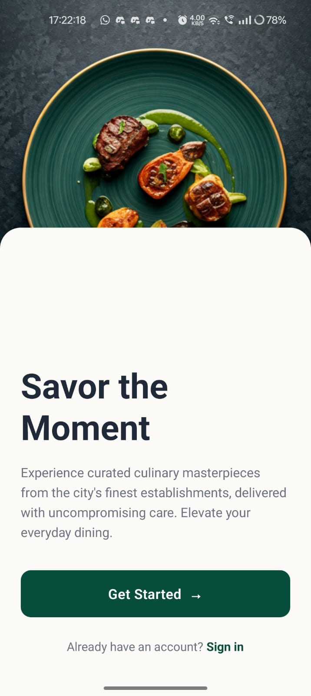</td>
    <td>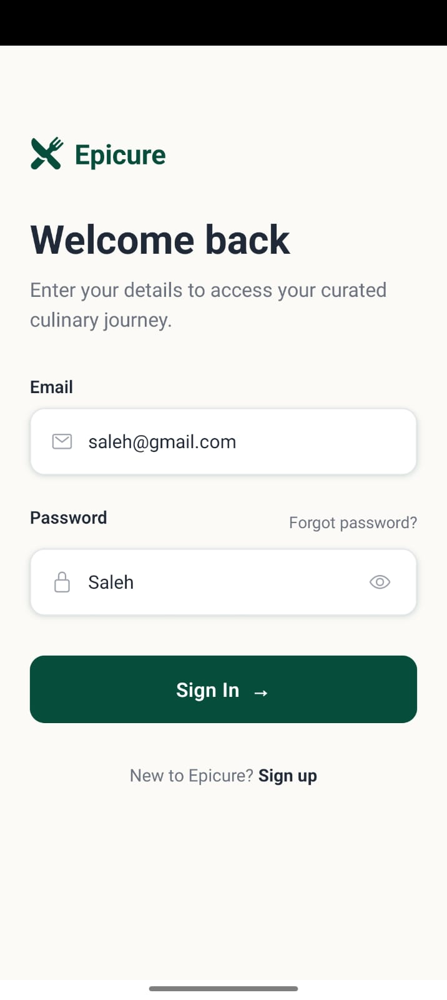</td>
    <td>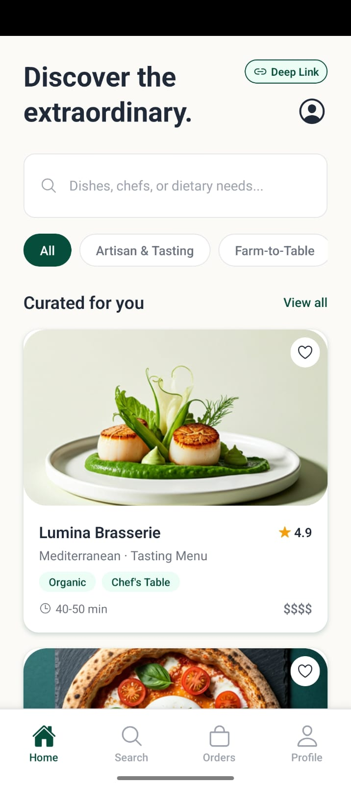</td>
  </tr>
  <tr>
    <td>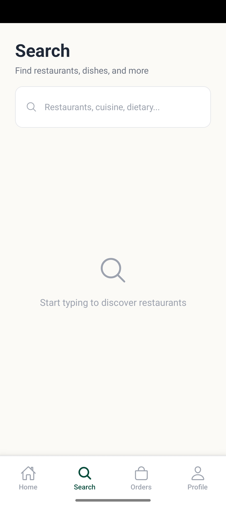</td>
    <td>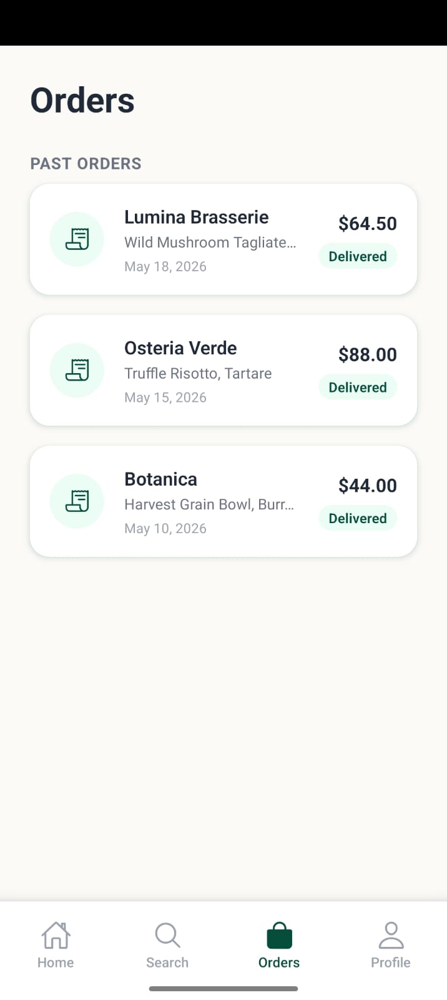</td>
    <td>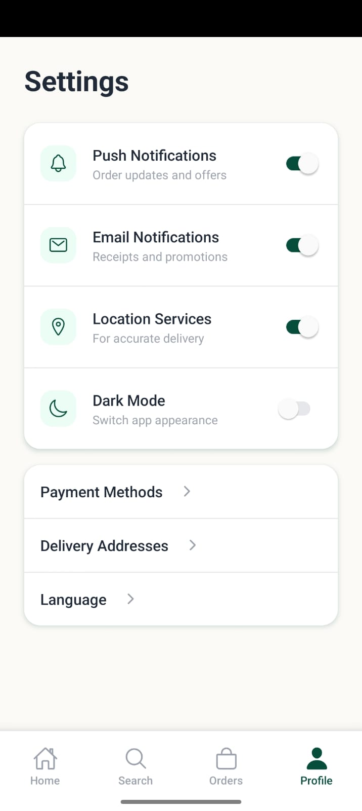</td>
  </tr>
  <tr>
    <td>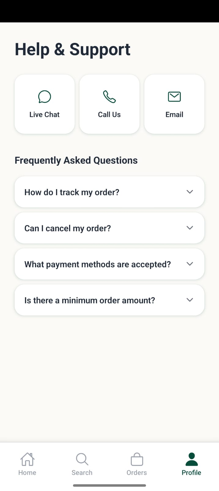</td>
    <td>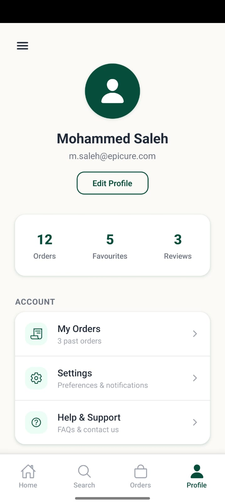</td>
    <td>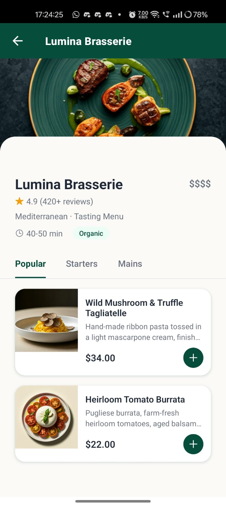</td>
  </tr>
  <tr>
    <td>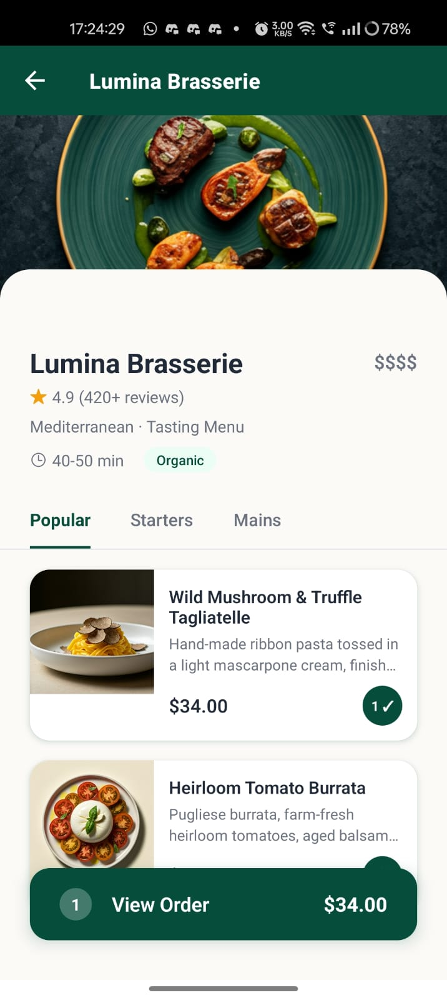</td>
    <td>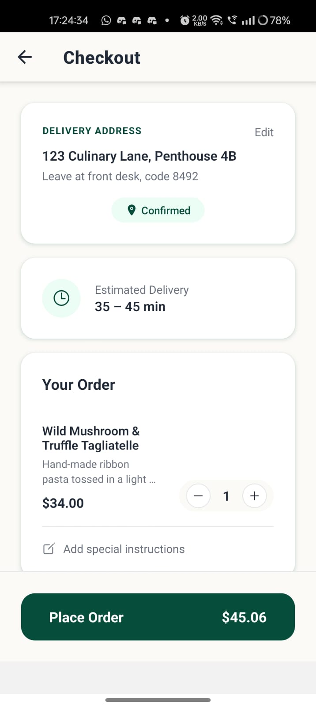</td>
    <td>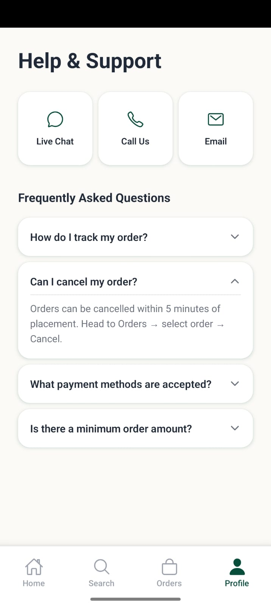</td>
  </tr>
</table>

## Navigation Structure

```
RootNavigator (Stack)
├── Onboarding
├── Auth (Stack)
│   └── Login
└── Main (Bottom Tabs)
    ├── Home (Stack)
    │   ├── HomeScreen
    │   ├── RestaurantDetail
    │   └── Cart
    ├── Search
    ├── Orders
    └── Profile (Drawer)
        ├── ProfileScreen
        ├── MyOrders
        ├── Settings
        └── Help
```

## Deep Linking

```
foodapp://restaurant/:id
```

## Tech Stack

- Expo SDK 55
- React Navigation 7 (Stack, Bottom Tabs, Drawer)
- React Native Reanimated 4
- React Native Gesture Handler
- TypeScript
